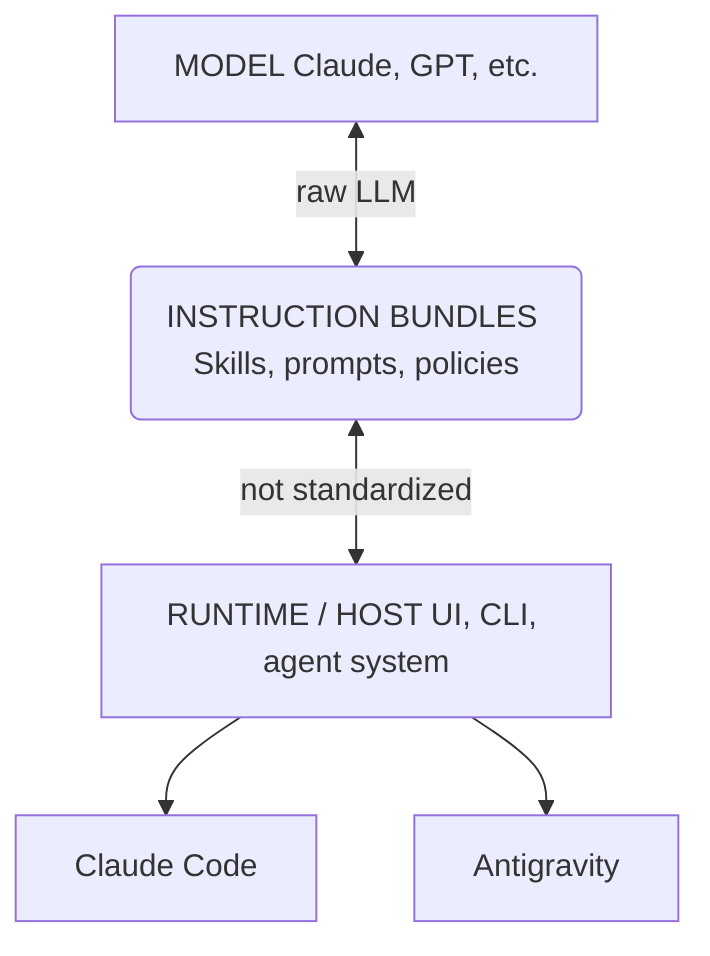

# Tool-agnostic Agent Skills for LLM-based runtimes (Claude, Gemini, Antigravity)

This repository contains LLM Agent Skills: reusable, structured instruction modules designed to be loaded by LLM agent runtimes. Skills are model-agnostic, tool-agnostic, and portable across environments such as Claude Code and Gemini/Antigravity.

## Supported Universally
These skills are compatible with:
*   **Antigravity**
*   **Claude Code**
*   **OpenAI Swarm**
*   **LangChain / LangGraph** agents
*   Custom in-house agent frameworks


## Architecture


*Note: This diagram illustrates the role of skills as instruction bundles bridge between runtimes and models.*

```text
┌─────────────────────────────┐
│  MODEL (Claude, GPT, etc.)  │  ← raw LLM
└─────────────────────────────┘
            ▲
┌─────────────────────────────┐
│  INSTRUCTION BUNDLES        │  ← "Skills", prompts, policies
│  (NOT standardized)        │
└─────────────────────────────┘
            ▲
┌─────────────────────────────┐
│  RUNTIME / HOST             │  ← Claude.ai, Claude Code,
│  (UI, CLI, agent system)    │     Antigravity, IDEs, etc.
└─────────────────────────────┘ 
```

## What is a Skill?
A skill is a self-contained package of instructions and logic defined in a `SKILL.md` file. By adhering to the [standard](SKILL_STANDARD_SPEC.md), these skills allow any compatible agent to perform specialized, complex tasks without vendor lock-in.

## Available Skills

| Skill Name | Description |
| :--- | :--- |
| [Crypto Investor L2 Scoreboard](skills/crypto_investor_l2_scoreboard) | Researches and scores L2 blockchains based on adoption and momentum. |

### Installation
Use the provided `agent_skills_install.py` script to install skills.

> [!NOTE] 
> **Standardization Note:** The installation paths and methods documented here reflect the current conventions for Antigravity, Gemini, and Claude Code. As the [Agent Skill Standard](SKILL_STANDARD_SPEC.md) evolves, these locations may change.

#### Standard Install (Recommended)
This command installs all skills defined in `skills.yaml` to **all** detected standard agent locations (Antigravity, Claude Code, Gemini). It uses a **copy/overwrite** method by default to ensure maximum compatibility.

```bash
python3 agent_skills_install.py
```

#### Advanced Options

```bash
# Install only for a specific runtime
python3 agent_skills_install.py --claude-code
python3 agent_skills_install.py --antigravity

# Install to a custom directory
python3 agent_skills_install.py --target /path/to/custom/folder

# Use symlinks instead of copying (useful for skill development)
# Note: Some environments (like Claude Code) may not support symlinks.
python3 agent_skills_install.py --symlink
```

## Testing & Verification

After installation, you must verify that the agent has loaded the new skills.

### Claude Code
1.  **Restart Claude Code** (Critical: Skills are often only loaded on startup).
2.  **Use "Code" Mode**: You **MUST** use the **Code** tab in Claude Desktop (not Chat or Cowork) to test skills.
3.  **Test with a trigger phrase**: Try saying "Create a crypto investor scoreboard".
4.  **Check if recognized**: The skill should activate based on the description trigger.

### Antigravity
1.  **Restart the Agent Session**: Reload the window or restart the agent process to ensure the skills cache is rebuilt.
2.  **Verify Skill Availability**: Ask "What skills do you have available?" or check the agent's startup logs.
3.  **Test Execution**: Run a command like "Run the crypto L2 scoreboard".

### Troubleshooting
*   **macOS Permissions**: If the agent fails to load the skill, it might be due to macOS "Quarantine" attributes on downloaded files. The installation script now automatically attempts to fix this by running `xattr -cr`. If issues persist, you can manually run:
    ```bash
    xattr -cr ~/.claude/skills/crypto-investor-l2-scoreboard
    ```

## Contributing
We welcome contributions! Please ensure your skills follow the [Specification](SKILL_STANDARD_SPEC.md).

1.  Create a new folder in `skills/`.
2.  Create a `SKILL.md` with YAML frontmatter + instructions.
3.  (Optional) Add a `README.md` for human readers.
4.  Submit a Pull Request.
